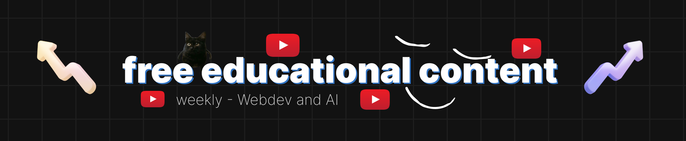

<!--  -->

# 👋 Hello, I'm Varad Deshpande! 
#### 🛠️ Exploring **Softwares, AI and Electronics**  
#### 🔬 Passionate about **Web Development, AI, VLSI and Embedded Systems**  
#### 💡 Currently working on: **AI Agents Development and Edge AI Projects** 
#### 📚 Software Engineer working at a Voice AI Startup
#### 🌎 Love building **Innovative, research-driven tech solutions**  

---

## 💻 Tech Stack   

  
  
  
  
  
  
  
  
  
  

---

## ⚡ Latest Projects  
- 🏍️ **Pro-Resume** – AI-powered Latex-Based Resume Generator
- 🛠️ **Face Mask Detection System** – Optimized Edge AI deployment on Jetson Nano 
- 🖥️ **Medimitra** – Voice Enabled Medicine Reminder    
- 🏍️ **Smart Helmet Universal Module** – AI-powered safety & navigation device  
- 🖥️ **Resume to Job Matcher** – AI-based job recommendation system  
- 🌐 **Self-Hosted AI Interface** – Run LLMs locally with a smooth UI   -->

---

## 🔗 Connect with Me  
💼 [LinkedIn](https://www.linkedin.com/in/varaddeshpande15)  
📷 [Instagram](https://www.instagram.com/streak.dev)  
🐦 [Twitter](https://twitter.com/dev_varad)  
🌐 [Portfolio](https://varaddeshpande.netlify.app/)  

---

---

## 📊 GitHub Stats:
 
 

---

## 🏆 GitHub Trophies:

---

## 🎯 Random Dev Quote:

---

## 🔝 Top Contributed Repos:

---

## 🐍 GitHub Contribution Snake:
<picture>
  <source media="(prefers-color-scheme: dark)" srcset="https://raw.githubusercontent.com/varaddeshpande15/varaddeshpande15/output/github-snake-dark.svg" />
  <source media="(prefers-color-scheme: light)" srcset="https://raw.githubusercontent.com/varaddeshpande15/varaddeshpande15/output/github-snake.svg" />
  
</picture>

---

